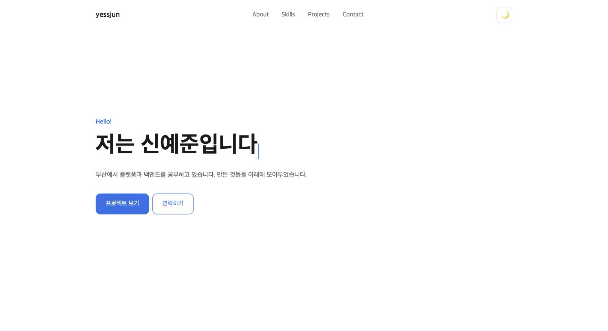
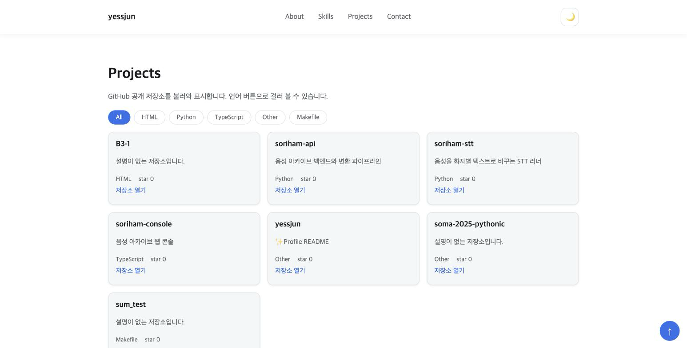
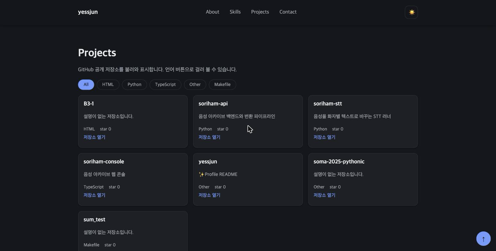
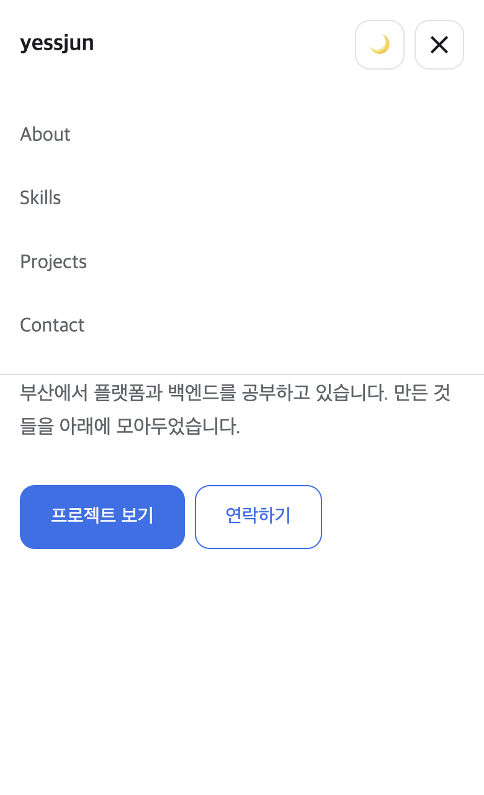
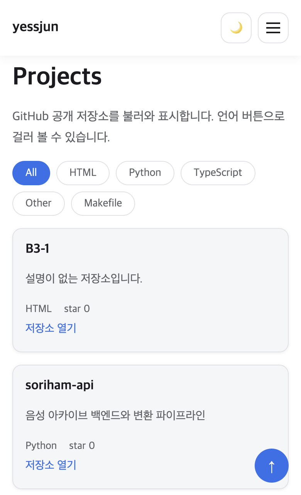

# B1-1 나를 소개하는 웹페이지 처음부터 만들기

HTML, CSS, JavaScript만으로 반응형 포트폴리오 웹사이트를 만들고 GitHub Pages에 배포했습니다. React, jQuery, Bootstrap 같은 라이브러리는 사용하지 않았고, Projects 섹션은 GitHub API로 제 공개 저장소를 받아와 화면에 그립니다.

배포 주소는 https://yessjun.github.io/B1-1/ 입니다.

## 사용 기술

- HTML5 시맨틱 태그
- CSS 변수, Flexbox, Grid, 미디어 쿼리
- JavaScript (ES6+, DOM API, fetch, Intersection Observer, localStorage)
- GitHub REST API
- GitHub Pages

## 실행 환경

```bash
$ sw_vers -productVersion
15.7.7

$ code --version
1.138.0
7debcd0e2acdea1c52de81bf9ee1620444407dda
arm64

$ code --list-extensions --show-versions | grep -i liveserver
ritwickdey.liveserver@5.7.10
```

VS Code에서 작성하고 Live Server 확장으로 띄운 로컬 서버에서 확인하면서 진행했습니다. 브라우저는 Chrome 153입니다.

## 디렉터리 구조

```
$ tree -a -I '.git'
.
├── .gitignore
├── css
│   └── style.css
├── images
│   └── profile.jpg
├── index.html
├── js
│   └── main.js
└── README.md

4 directories, 6 files
```

페이지는 `index.html` 하나이고 스타일과 스크립트는 외부 파일로 분리했습니다. 스크립트는 `defer`로 연결해 DOM이 만들어진 뒤에 실행되도록 했습니다.

```html
  <link rel="stylesheet" href="css/style.css">
  <script src="js/main.js" defer></script>
```

## 화면 구조

전체를 `div`로 감싸지 않고 역할이 드러나는 태그를 사용했습니다. 상단 고정 영역은 `header`와 `nav`, 본문은 `main` 아래 섹션 다섯 개, 하단은 `footer`입니다. 섹션마다 `id`를 두고 네비게이션에서 앵커로 연결합니다.

```html
  <header class="header" id="header">
    <nav class="nav" aria-label="주요 메뉴">
      <a class="logo" href="#home">yessjun</a>
      <ul class="nav-menu" id="nav-menu">
        <li><a href="#about">About</a></li>
        <li><a href="#skills">Skills</a></li>
        <li><a href="#projects">Projects</a></li>
        <li><a href="#contact">Contact</a></li>
      </ul>
      <div class="nav-actions">
        <button type="button" class="theme-toggle" id="theme-toggle" aria-label="다크 모드 전환">
          <span id="theme-icon">🌙</span>
        </button>
        <button type="button" class="hamburger" id="hamburger" aria-label="메뉴 열기" aria-expanded="false" aria-controls="nav-menu">
          <span></span>
          <span></span>
          <span></span>
        </button>
      </div>
    </nav>
  </header>
```

Skills의 그룹 카드와 Projects의 저장소 카드는 각각 떼어놓아도 의미가 유지되는 단위라 `article`로 감쌌습니다. 프로필 사진에는 누구의 사진인지 알 수 있는 `alt`를 넣었고, 폼의 `label`은 `for`와 입력 요소의 `id`를 맞춰 연결했습니다.

## 레이아웃과 반응형

색상, 폰트, 간격, 모서리 반경, 전환 시간을 `:root`에 변수로 두고, 다크 모드용 값은 `[data-theme="dark"]`에 따로 정의했습니다. 테마를 바꿀 때 이 속성만 교체하면 화면 전체가 함께 바뀝니다.

```css
:root {
  --color-bg: #ffffff;
  --color-surface: #f5f6f8;
  --color-text: #1b1b1f;
  --color-muted: #5f6368;
  --color-border: #e0e2e7;
  --color-accent: #2f6feb;
  --color-accent-text: #ffffff;
  --color-header: rgba(255, 255, 255, 0.85);
  --color-shadow: rgba(16, 24, 40, 0.08);

  --font-body: "Pretendard", "Apple SD Gothic Neo", "Segoe UI", sans-serif;
  --font-size-title: 2rem;

  --space-xs: 0.5rem;
  --space-sm: 1rem;
  --space-md: 2rem;
  --space-lg: 4rem;
  --radius: 12px;
  --transition: 0.2s ease;
}

[data-theme="dark"] {
  --color-bg: #15171c;
  --color-surface: #1d2026;
  --color-text: #e9eaee;
  --color-muted: #a0a5ae;
  --color-border: #2c3038;
  --color-accent: #6f9bff;
  --color-accent-text: #12141a;
  --color-header: rgba(21, 23, 28, 0.85);
  --color-shadow: rgba(0, 0, 0, 0.4);
}

* {
  box-sizing: border-box;
}

body {
  margin: 0;
```

네비게이션은 로고, 메뉴, 버튼 묶음을 한 줄에 배치해야 해서 Flexbox를 사용했습니다. `justify-content: space-between`으로 로고를 왼쪽, 나머지를 오른쪽에 붙입니다.

```css
.nav {
  display: flex;
  align-items: center;
  justify-content: space-between;
  max-width: 1100px;
  margin: 0 auto;
  padding: var(--space-sm);
}

.logo {
  font-weight: 700;
  font-size: 1.125rem;
}

.nav-menu {
  display: none;
}

.nav-menu.active {
  display: flex;
  flex-direction: column;
  gap: var(--space-xs);
```

Projects 카드는 개수가 API 응답에 따라 달라지므로 Grid의 `auto-fit`과 `minmax`를 사용했습니다. 카드 최소 폭을 260px로 두면 화면 폭에 따라 열 개수가 알아서 정해집니다.

```css
.project-grid {
  display: grid;
  grid-template-columns: repeat(auto-fit, minmax(260px, 1fr));
  gap: var(--space-sm);
}
```

기본 스타일은 모바일 기준으로 작성하고, 768px과 1024px에서 필요한 부분만 재정의합니다. 768px 미만에서는 메뉴가 감춰지고 햄버거 버튼이 보입니다.

```css
@media (min-width: 768px) {
  .hamburger {
    display: none;
  }

  .nav-menu {
    display: flex;
    gap: var(--space-md);
  }

  .hero-title {
    font-size: 3rem;
  }

  .caret {
    height: 2.4rem;
  }
```

## 다크 모드

테마는 `data-theme` 속성 하나로 관리합니다. 첫 진입 때는 로컬스토리지에 저장된 값을 먼저 보고, 없으면 `prefers-color-scheme`으로 시스템 설정을 따릅니다. 버튼을 누르면 상태를 바꾸고 로컬스토리지에 기록하므로 새로고침해도 유지됩니다.

```javascript
function applyTheme(theme) {
  state.theme = theme;
  document.documentElement.setAttribute("data-theme", theme);
  themeIcon.textContent = theme === "dark" ? "☀️" : "🌙";
  themeToggle.setAttribute("aria-label", theme === "dark" ? "라이트 모드 전환" : "다크 모드 전환");
}

function initTheme() {
  const saved = localStorage.getItem("theme");
  if (saved === "dark" || saved === "light") {
    applyTheme(saved);
    return;
  }
  const prefersDark = window.matchMedia("(prefers-color-scheme: dark)").matches;
  applyTheme(prefersDark ? "dark" : "light");
}

themeToggle.addEventListener("click", () => {
  const next = state.theme === "dark" ? "light" : "dark";
  applyTheme(next);
  localStorage.setItem("theme", next);
});
```

## 네비게이션과 스크롤

햄버거 버튼은 `classList.toggle`로 메뉴에 `active` 클래스를 추가하거나 제거합니다. 버튼의 `aria-expanded`도 같이 바꿉니다.

```javascript
function toggleMenu(open) {
  state.menuOpen = open;
  navMenu.classList.toggle("active", open);
  hamburger.classList.toggle("active", open);
  hamburger.setAttribute("aria-expanded", String(open));
  hamburger.setAttribute("aria-label", open ? "메뉴 닫기" : "메뉴 열기");
}

hamburger.addEventListener("click", () => toggleMenu(!state.menuOpen));
```

앵커 링크는 `event.preventDefault()`로 기본 이동을 막고 `scrollIntoView`로 부드럽게 옮깁니다. 모바일에서 메뉴를 열어둔 채 항목을 누르면 이동과 함께 메뉴를 닫습니다.

스크롤 이벤트에서는 두 가지를 확인합니다. 60px을 넘으면 네비게이션에 배경색과 그림자를 넣고, 300px을 넘으면 맨 위로 이동하는 버튼을 표시합니다. 섹션 등장 효과는 Intersection Observer로 처리했고 임계값은 0.2입니다.

```javascript
window.addEventListener("scroll", () => {
  const y = window.scrollY;
  header.classList.toggle("scrolled", y > SCROLL_HEADER);
  toTop.classList.toggle("visible", y > SCROLL_TOP_BUTTON);
});

toTop.addEventListener("click", () => {
  window.scrollTo({ top: 0, behavior: "smooth" });
});

const observer = new IntersectionObserver(
  (entries) => {
    entries.forEach((entry) => {
      if (entry.isIntersecting) {
        entry.target.classList.add("visible");
        observer.unobserve(entry.target);
      }
    });
  },
  { threshold: REVEAL_THRESHOLD }
);

document.querySelectorAll(".section").forEach((section) => {
  section.classList.add("reveal");
  observer.observe(section);
});
```

## Projects: GitHub API 연동

`https://api.github.com/users/yessjun/repos`를 `fetch`와 `async/await`로 호출합니다. 응답에서 필요한 값만 구조분해로 꺼내 화면에서 사용할 형태로 정리해 상태에 담습니다. 포크한 저장소는 직접 만든 것이 아니라 목록에서 제외했습니다.

```javascript
async function loadProjects() {
  state.status = "loading";
  filters.innerHTML = "";
  renderProjects();

  try {
    const response = await fetch(`https://api.github.com/users/${GITHUB_USER}/repos?per_page=100&sort=updated`);
    if (!response.ok) {
      throw new Error(`GitHub API ${response.status}`);
    }
    const data = await response.json();
    state.repos = data
      .filter((repo) => !repo.fork)
      .map(({ name, description, language, stargazers_count, html_url }) => ({
        name,
        description: description || "설명이 없는 저장소입니다.",
        language: language || "Other",
        stars: stargazers_count,
        url: html_url,
      }));
    state.status = "loaded";
    renderFilters();
    renderProjects();
  } catch (error) {
    state.status = "error";
    renderProjects();
  }
}
```

화면은 상태를 보고 그립니다. 로딩 중에는 안내 문구를 표시하고, 실패하면 다시 시도 버튼을 함께 표시하며, 성공했지만 표시할 항목이 없으면 빈 상태 문구를 표시합니다. 인증 없이 호출하면 시간당 60회 제한이 있어 403이 돌아오는데, 이때도 `response.ok`가 거짓이라 같은 에러 경로로 들어갑니다.

```javascript
function renderProjects() {
  const { repos, language, status } = state;

  if (status === "loading") {
    projectsState.textContent = "로딩 중...";
    projectList.innerHTML = "";
    return;
  }

  if (status === "error") {
    projectsState.innerHTML = '프로젝트를 불러올 수 없습니다. <button type="button" class="retry-button" id="retry">다시 시도</button>';
    projectList.innerHTML = "";
    document.querySelector("#retry").addEventListener("click", loadProjects);
    return;
  }

  const visible = language === "All" ? repos : repos.filter((repo) => repo.language === language);

  if (visible.length === 0) {
    projectsState.textContent = "표시할 프로젝트가 없습니다.";
    projectList.innerHTML = "";
    return;
  }

  projectsState.textContent = "";
  projectList.innerHTML = visible
    .map(({ name, description, language: repoLanguage, stars, url }) => `
```

## 문의 폼

검증 규칙을 필드 이름별 함수로 두고, 빈 값과 이메일 형식을 확인합니다. 에러 메시지는 각 입력 아래에 표시하고 입력 테두리 색도 함께 바꿉니다. 한 번 에러가 난 필드는 `input` 이벤트로 다시 검사해 고치는 즉시 메시지가 사라집니다.

```javascript
const validators = {
  name: (value) => (value.trim() === "" ? "이름을 입력해 주세요." : ""),
  email: (value) => {
    if (value.trim() === "") {
      return "이메일을 입력해 주세요.";
    }
    return /^[^\s@]+@[^\s@]+\.[^\s@]+$/.test(value.trim()) ? "" : "이메일 형식이 올바르지 않습니다.";
  },
  message: (value) => (value.trim() === "" ? "메시지를 입력해 주세요." : ""),
};
```

제출은 `event.preventDefault()`로 막고 직접 검사합니다. 하나라도 통과하지 못하면 제출을 중단하고, 전부 통과하면 성공 메시지를 표시한 뒤 폼을 초기화합니다.

```javascript
contactForm.addEventListener("submit", (event) => {
  event.preventDefault();
  const results = fields.map((field) => validateField(field));
  if (results.includes(false)) {
    formResult.textContent = "";
    return;
  }
  formResult.textContent = "메시지를 보냈습니다. 확인 후 답장드리겠습니다.";
  contactForm.reset();
});
```

## 화면

데스크톱 첫 화면입니다. Hero 문구는 한 글자씩 나타났다가 다음 문장으로 바뀝니다.



Projects 섹션은 GitHub에서 받아온 저장소를 카드로 보여주고, 위쪽 버튼으로 언어를 고를 수 있습니다.



다크 모드입니다. 토글 버튼을 누르면 배경, 글자, 카드, 테두리 색이 함께 바뀝니다.



모바일 폭 390px입니다. 메뉴가 햄버거 버튼 안으로 들어가고, 버튼을 누르면 아래로 펼쳐집니다.



같은 폭에서 Projects 섹션은 카드가 한 열로 쌓입니다.



## 보너스: 언어별 프로젝트 필터링

받아온 저장소의 `language` 값을 모아 중복을 없애고 버튼을 만듭니다. 버튼을 누르면 선택한 언어를 상태에 넣고 목록을 다시 그립니다. 걸러내는 일은 `filter`가 하고, 언어를 지정하지 않은 저장소는 `Other`로 묶었습니다.

```javascript
function renderFilters() {
  const languages = ["All", ...new Set(state.repos.map((repo) => repo.language))];
  filters.innerHTML = languages
    .map((language) => `<button type="button" class="filter-button" data-language="${language}">${language}</button>`)
    .join("");

  filters.querySelectorAll(".filter-button").forEach((button) => {
    button.classList.toggle("active", button.dataset.language === state.language);
    button.addEventListener("click", () => {
      state.language = button.dataset.language;
      renderFilters();
      renderProjects();
    });
  });
}
```

## 보너스: Hero 타이핑 효과

문장 세 개를 한 글자씩 늘렸다가 다시 지우고 다음 문장으로 넘어갑니다. 글자를 더할 때와 지울 때 간격을 다르게 두었고, 문장을 다 쓴 뒤에는 1.5초 머무릅니다. 커서는 CSS 애니메이션으로 깜빡입니다.

```javascript
function runTyping(wordIndex, letterIndex, deleting) {
  const word = TYPING_WORDS[wordIndex];
  typing.textContent = word.slice(0, letterIndex);

  if (!deleting && letterIndex === word.length) {
    setTimeout(() => runTyping(wordIndex, letterIndex, true), 1500);
    return;
  }
  if (deleting && letterIndex === 0) {
    runTyping((wordIndex + 1) % TYPING_WORDS.length, 0, false);
    return;
  }
  const nextIndex = deleting ? letterIndex - 1 : letterIndex + 1;
  setTimeout(() => runTyping(wordIndex, nextIndex, deleting), deleting ? 60 : 120);
}
```

## 보너스: 시스템 다크 모드 감지

저장된 테마가 없을 때만 `prefers-color-scheme`을 확인해 초기 테마를 정합니다. 한 번이라도 토글 버튼을 누르면 그 선택이 로컬스토리지에 남아 시스템 설정보다 앞섭니다. 위 다크 모드 절의 `initTheme`가 이 순서를 담고 있습니다.

## 배포

GitHub Pages로 배포했습니다. 저장소의 `main` 브랜치 루트를 그대로 게시하는 방식이라 빌드 과정은 없습니다.

```bash
$ curl -sI https://yessjun.github.io/B1-1/ | head -3
HTTP/2 200 
server: GitHub.com
content-type: text/html; charset=utf-8

$ curl -s -o /dev/null -w "%{http_code} %{url_effective}\n" https://yessjun.github.io/B1-1/css/style.css
200 https://yessjun.github.io/B1-1/css/style.css
200 https://yessjun.github.io/B1-1/js/main.js
200 https://yessjun.github.io/B1-1/images/profile.jpg
```

배포된 주소에서 저장소 목록 불러오기, 언어 필터, 다크 모드와 새로고침 후 유지, 폼 검증, 햄버거 메뉴를 다시 확인했습니다. 경로를 상대경로로 적었기 때문에 `/B1-1/` 하위에 올라가도 스타일시트와 스크립트, 이미지가 그대로 붙습니다.

## 실행 방법

저장소를 받아 VS Code로 열고 Live Server 확장의 Go Live를 누르면 됩니다. 확장 없이 확인하려면 폴더에서 정적 서버를 실행해도 됩니다.

```bash
$ git clone https://github.com/yessjun/B1-1.git
$ cd B1-1
$ python3 -m http.server 8081
```

`file://`로 열면 GitHub API 호출이 막히므로 서버를 통해 열어야 합니다.

## 개념 정리

### 시맨틱 태그와 구조 설계

`div`는 의미가 없는 상자라서 화면을 다 만들고 나면 어디가 무슨 영역인지 코드만 보고는 알기 어렵습니다. `header`, `nav`, `main`, `section`, `article`, `footer`는 태그 이름 자체가 역할을 말해주고, 스크린 리더와 검색 엔진도 같은 정보를 사용합니다.

구조는 방문자가 읽는 순서대로 잘랐습니다. 먼저 누구인지 알리고(Hero), 배경을 설명하고(About), 다룰 줄 아는 것을 보여주고(Skills), 실제 결과물을 늘어놓고(Projects), 연락 수단으로 끝냅니다(Contact). 각 덩어리는 문서 안에서 독립된 주제라 `section`으로 감쌌고, 그 안에서 카드처럼 하나씩 떼어도 말이 되는 단위는 `article`로 감쌌습니다. 상단 고정 영역은 `header`, 그 안의 링크 묶음은 `nav`입니다.

### Flexbox와 Grid

Flexbox는 한 방향으로 늘어놓는 도구이고 Grid는 행과 열을 같이 잡는 도구입니다. 네비게이션은 로고와 메뉴, 버튼을 가로 한 줄에 배치하고 남는 공간을 어떻게 나눌지만 정하면 되므로 Flexbox가 맞습니다. 반면 Projects 카드는 화면 폭에 따라 한 줄에 들어갈 개수가 달라져야 하고, 세로 간격도 같이 맞춰야 해서 Grid를 사용했습니다.

`repeat(auto-fit, minmax(260px, 1fr))`은 열 개수를 직접 세지 않고 "카드가 260px보다 작아지면 줄을 바꾼다"는 규칙만 적는 방식입니다. 미디어 쿼리로 열 개수를 단계마다 지정하지 않아도 되므로 카드 개수가 API 응답에 따라 달라지는 이 화면에 맞습니다.

### DOM 선택과 이벤트 연결

`querySelector`는 CSS 선택자로 요소 하나를, `querySelectorAll`은 조건에 맞는 요소 전부를 가져옵니다. 가져온 요소에 `addEventListener`로 동작을 붙이면, 어떤 이벤트에 무엇이 실행되는지가 자바스크립트 파일 한 곳에 모입니다. HTML에 `onclick`을 적으면 화면 구조와 동작이 섞이고, 같은 요소에 동작을 둘 이상 붙이기도 어렵습니다.

이 페이지에서는 다섯 종류를 다룹니다. 버튼의 `click`, 폼의 `submit`, 입력 칸의 `input`, 창의 `scroll`, 그리고 Intersection Observer가 대신 알려주는 화면 진입입니다. 앵커 링크와 폼은 브라우저가 원래 하려던 동작이 있어서 `event.preventDefault()`로 먼저 막고 직접 처리합니다.

### ES6 문법과 배열 메서드

화살표 함수는 짧게 쓸 수 있고 자기 `this`를 만들지 않아 콜백으로 넘기기 좋습니다. 이벤트 처리기와 `map`, `filter`에 넘기는 함수는 전부 화살표 함수입니다.

구조분해 할당은 객체에서 필요한 값만 이름을 적어 꺼내는 문법입니다. GitHub 응답에는 서른 개가 넘는 필드가 들어 있는데, 화면에 쓰는 것은 이름, 설명, 언어, 스타 수, 주소 다섯 개뿐이라 꺼내 쓰는 쪽이 코드가 짧아집니다.

```javascript
.map(({ name, description, language, stargazers_count, html_url }) => ({
```

배열 메서드는 목적이 이름에 드러납니다. `map`은 저장소 데이터를 카드 HTML 문자열로 바꾸고, `filter`는 포크 제외와 언어 선택에 쓰이고, `forEach`는 버튼마다 이벤트를 연결할 때처럼 값을 돌려받을 필요가 없을 때 사용합니다. 반복문을 직접 쓰는 것과 결과는 같지만, 무엇을 하려는지가 한 단어로 보입니다.

### 비동기 데이터와 상태 표현

`fetch`는 네트워크 응답을 기다리는 동안 다음 코드를 막지 않고 Promise를 돌려줍니다. `async/await`를 쓰면 그 Promise를 기다리는 코드를 위에서 아래로 읽히는 모양으로 쓸 수 있습니다.

요청은 성공만 하는 것이 아니라서 화면에는 네 가지 상태가 필요합니다. 요청을 보낸 직후에는 로딩 문구, 성공하면 카드 목록, 실패하면 안내 문구와 다시 시도 버튼, 성공했지만 항목이 없으면 빈 상태 문구입니다. 네트워크 자체가 끊기면 `fetch`가 예외를 던지고, 서버가 403 같은 응답을 주면 예외 대신 `response.ok`가 거짓이 됩니다. 두 경우를 같이 다루려고 상태 코드를 확인해 직접 예외를 던지고 `try/catch`에서 한 번에 받습니다.

### 이벤트에서 화면까지

하나의 기능은 이벤트를 받아 상태를 바꾸고, 바뀐 상태로 화면을 다시 그리는 순서로 만들었습니다. 화면을 직접 고치는 대신 상태를 고치고 다시 그리면, 지금 화면이 어떤 상태인지 코드 한 곳만 보면 됩니다. 이 페이지에는 그런 흐름이 세 가지 있습니다.

| 이벤트 | 바뀌는 상태 | 화면 |
|---|---|---|
| 토글 버튼 클릭 | `state.theme` | `data-theme` 속성이 바뀌며 전체 색이 교체됩니다 |
| 저장소 요청과 응답 | `state.status`, `state.repos` | Projects 영역이 로딩, 목록, 에러, 빈 상태 중 하나로 그려집니다 |
| 폼 제출과 입력 | 필드별 검증 결과 | 해당 입력 아래 에러 메시지와 테두리 색이 바뀝니다 |

언어 필터도 같은 모양입니다. 버튼을 누르면 `state.language`만 바꾸고 목록을 다시 그립니다. 카드를 직접 지우거나 숨기지 않습니다.

React를 쓰면 이 다시 그리는 부분을 라이브러리가 맡고 상태만 선언하면 되는데, 지금은 그 자리에 `renderProjects` 같은 함수를 직접 두었습니다.

## 트러블슈팅

### 필터 버튼에 빈 이름이 생기는 문제

저장소 목록을 먼저 받아보니 `language`가 `null`인 항목이 있었습니다. 그대로 버튼을 만들면 이름이 없는 버튼이 생기고 카드의 언어 자리도 비어 보입니다. 값을 꺼낼 때 `language || "Other"`로 기본값을 주고, 필터도 이 값으로 묶었습니다. 같은 응답에 포크한 저장소도 섞여 있어서 목록에 넣기 전에 `fork`가 참인 항목을 걸러냈습니다.

```bash
$ curl -s "https://api.github.com/users/yessjun/repos?per_page=100" | grep -c '"fork": true'
4
```

### 에러 상태를 실제로 확인하기

에러 화면은 요청이 실패해야 볼 수 있는데 GitHub API는 대체로 성공합니다. 브라우저 콘솔에서 `fetch`를 잠시 실패하도록 바꿔놓고 다시 불러와 확인했습니다.

```javascript
window.fetch = () => Promise.resolve({ ok: false, status: 403 });
loadProjects();
```

이때 안내 문구와 다시 시도 버튼이 나타나는 것, 버튼을 누르면 다시 요청하는 것을 확인했습니다. 다시 시도 버튼은 `innerHTML`로 에러 문구를 그릴 때마다 새로 만들어지므로, 버튼을 그린 직후에 이벤트를 연결해야 합니다. 그리는 코드 바깥에서 한 번만 연결하면 두 번째 실패부터는 눌러도 반응하지 않습니다.
